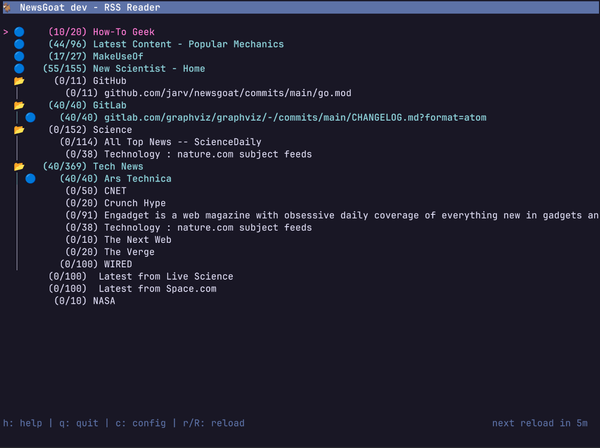

# NewsGoat

<p align="center">
  
  
</p>

NewsGoat is a terminal-based RSS reader written in Go using the [bubbletea TUI framework](https://github.com/charmbracelet/bubbletea).
It's inspired by [Newsbeuter](https://github.com/akrennmair/newsbeuter)/[Newsboat](https://github.com/newsboat/newsboat) and provides a vi-like interface for reading RSS feeds.

## Why create another terminal-based RSS reader?

I’ve been using terminal-based RSS readers for about 15 years.
The first program I used was [Newsbeuter](https://github.com/akrennmair/newsbeuter), but around 2017 its maintainer announced it would no longer be maintained, so I switched to its fork, [Newsboat](https://github.com/newsboat/newsboat).
Over time, I grew frustrated with frequent segfaults, especially after the Rust rewrite, and started looking for alternatives. A similar CLI RSS reader written in Go called [nom](https://github.com/guyfedwards/nom) looked interesting, but it didn’t offer the feed organization I wanted.

Meanwhile, “vibe coding” was catching on, and it seemed like a fun excuse to see how quickly I could build my own news reader in Go with exactly the features I wanted. After about a day of prompting, tweaking, and vibing through the process, here’s the result—enjoy!

## Features

- Feeds are grouped by the feed URL.
- Quickly query info for every feed including cache-control, last-updated, etc. Press <kbd>i</kbd> to view feed info.
- Error logs are shown directly in the UI for feed troubleshooting. Press <kbd>l</kbd> to view logs.
- Refresh task control separate in the app with a way to see what is queued, running and failures. Press <kbd>t</kbd> to view tasks.
- Option to put feeds with unread items at the top. Press <kbd>c</kbd> to configure.
- Automatic feed discovery when adding URLs. Press <kbd>u</kbd> to add a youtube link and automatically subscribe to the channel's feed.

## Design Principles

- **Beautiful and compact**: Compact design and tactful use of emojis.
- **Opinionated**: It was built with one (my own) preferred configuration for Newsboat in mind, it is not as configurable as the alternatives.
- **A good "netizen"**: It follows [feed reader best practices](https://rachelbythebay.com/fs/help.html), including
  - respecting cache-control sent by the feed server
  - sending conditional responses
  - setting a useful user-agent
- **Local only**: There are no current plans for cloud syncing, sorry!
- **URLs as plain text**: I am not a fan of yaml based configuration so feed URLs are in a plain text file similar to Newsboat
- **Configuration in the UI**: For what little configuraiton there is, it is set in the UI instead of through a configuration file

## Alternatives

- The original CLI based newsreader [newsbeuter](https://github.com/akrennmair/newsbeuter).
- Newsbeuter was archived, and I think was forked as [newsboat](https://github.com/newsboat/newsboat) and re-written in Rust.
- [nom](https://github.com/guyfedwards/nom) is a similar CLI based news reader (also written in Go).

If you know of any other CLI based RSS readers worth mentioning here please add them!

## Configure

Create a `.config/newsgoat/urls` file with one feed per line.

## Build and Run

```bash
go run . # Run with urls file in .config/newsgoat/urls
go run . -urlFile urls.example # Run using the example urls file
```

## Install

### Quick Install (Recommended)

Install with a single command (macOS and Linux):

```bash
curl -sSL https://raw.githubusercontent.com/jarv/newsgoat/main/install.sh | bash
```

This will automatically detect your OS and architecture and install the latest version to `/usr/local/bin`.

### Manual Install

Download the latest release for your platform from the [releases page](https://github.com/jarv/newsgoat/releases):

#### macOS (Apple Silicon / Intel)

<details>

**Apple Silicon**

```bash
# Apple Silicon
curl -L https://github.com/jarv/newsgoat/releases/latest/download/newsgoat-darwin-arm64 -o newsgoat
chmod +x newsgoat
sudo mv newsgoat /usr/local/bin/
```

**Intel**

```bash
curl -L https://github.com/jarv/newsgoat/releases/latest/download/newsgoat-darwin-amd64 -o newsgoat
chmod +x newsgoat
sudo mv newsgoat /usr/local/bin/
```

</details>

#### Linux (amd64 / arm64)

<details>

**amd64**

```bash
curl -L https://github.com/jarv/newsgoat/releases/latest/download/newsgoat-linux-amd64 -o newsgoat
chmod +x newsgoat
sudo mv newsgoat /usr/local/bin/
```

**arm64**

```bash
curl -L https://github.com/jarv/newsgoat/releases/latest/download/newsgoat-linux-arm64 -o newsgoat
chmod +x newsgoat
sudo mv newsgoat /usr/local/bin/
```

</details>

## Add Feed URLs

There are three ways to add feed URLs to NewsGoat:

### 1. Via Command Line

Add a feed URL directly from the command line with automatic feed discovery:

```bash
newsgoat add <url>
```

NewsGoat will automatically discover the RSS/Atom feed URL from the provided URL. For example:

- `newsgoat add https://example.com` will find the feed link in the page
- `newsgoat add https://youtube.com/@channel` will discover the YouTube RSS feed

### 2. In the Application (Interactive)

Press `u` in the feed list view to open an interactive prompt where you can:

- Type or paste a URL
- Press Enter to add (with automatic feed discovery)
- Press Esc to cancel

### 3. Edit the URLs File Directly

Press `U` (Shift+U) in the feed list view to open `~/.config/newsgoat/urls` in your `$EDITOR`.

Alternatively, edit the file manually:

- Create/edit `~/.config/newsgoat/urls`
- Add one feed URL per line
- Lines starting with `#` are treated as comments
- Save and press `Ctrl+R` in NewsGoat to reload

Example `urls` file:

```text
# Tech News
https://feeds.feedburner.com/techcrunch
https://rss.cnn.com/rss/edition.rss

# YouTube Channels
https://www.youtube.com/@channel
```

## Keys

### Global (Available in All Views)

| Key | Description |
|-----|-------------|
| <kbd>h</kbd>, <kbd>?</kbd> | Show help |
| <kbd>q</kbd> | Go back / quit (press twice in feed view) |
| <kbd>Esc</kbd> | Go back (does nothing in feed view) |
| <kbd>Ctrl</kbd>+<kbd>C</kbd> | Go back / quit (press twice in feed view) |
| <kbd>j</kbd>, <kbd>↓</kbd> | Move down |
| <kbd>k</kbd>, <kbd>↑</kbd> | Move up |
| <kbd>Enter</kbd> | Select / open |
| <kbd>Ctrl</kbd>+<kbd>D</kbd> | Page down |
| <kbd>Ctrl</kbd>+<kbd>U</kbd> | Page up |

### Feed List View

| Key | Description |
|-----|-------------|
| <kbd>r</kbd> | Refresh selected feed |
| <kbd>R</kbd> | Refresh all feeds |
| <kbd>A</kbd> | Mark all items in feed as read |
| <kbd>i</kbd> | Show feed info (cache-control, last-updated, etc.) |
| <kbd>/</kbd> | Search feeds |
| <kbd>u</kbd> | Add URL (with automatic feed discovery) |
| <kbd>U</kbd> | Edit URLs file in $EDITOR |
| <kbd>Ctrl</kbd>+<kbd>R</kbd> | Reload URLs from file |
| <kbd>l</kbd> | View logs |
| <kbd>t</kbd> | View tasks |
| <kbd>c</kbd> | View settings |

### Item List View (Articles in a Feed)

| Key | Description |
|-----|-------------|
| <kbd>r</kbd> | Refresh current feed |
| <kbd>R</kbd> | Refresh all feeds |
| <kbd>A</kbd> | Mark all items as read |
| <kbd>N</kbd> | Toggle read status of selected item |
| <kbd>o</kbd> | Open item link in browser |
| <kbd>c</kbd> | View settings |
| <kbd>t</kbd> | View tasks |

### Article View

| Key | Description |
|-----|-------------|
| <kbd>1-9</kbd> | Open numbered link in browser |
| <kbd>o</kbd> | Open article link in browser |
| <kbd>n</kbd> | Next article |
| <kbd>N</kbd> | Previous article |
| <kbd>r</kbd> | Toggle raw HTML view |
| <kbd>c</kbd> | View settings |
| <kbd>t</kbd> | View tasks |

### Tasks View

| Key | Description |
|-----|-------------|
| <kbd>d</kbd> | Remove selected task |
| <kbd>c</kbd> | Clear all failed tasks |
| <kbd>l</kbd> | View logs |

### Log View

| Key | Description |
|-----|-------------|
| <kbd>c</kbd> | Clear all log messages |

### Settings View

| Key | Description |
|-----|-------------|
| <kbd>?</kbd> | Toggle settings help |
| <kbd>Enter</kbd> | Edit selected setting |

### Status Icons

| Icon | Meaning |
|------|---------|
| 🔵 | Unread items/feed |
| 🔍 | 404 Not Found |
| 🚫 | 403 Forbidden |
| ⏱️ | 429 Too Many Requests |
| ⚠️ | 500/502/503 Server Error |
| ⌛ | Timeout |
| ❌ | Other Error |
| 🕓 | Pending task |
| 🔄 | Running task |
| 💥 | Failed task |
